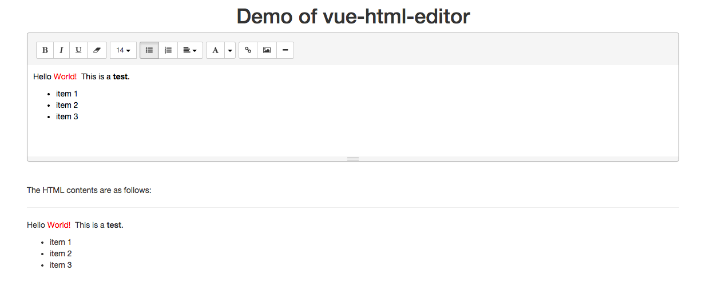

# vue-html-editor

[](https://circleci.com/gh/Haixing-Hu/vue-html-editor/tree/master)
[](https://coveralls.io/github/Haixing-Hu/vue-html-editor?branch=master)
[](https://www.bithound.io/github/Haixing-Hu/vue-html-editor)
[](https://david-dm.org/Haixing-Hu/vue-html-editor)
[](https://david-dm.org/Haixing-Hu/vue-html-editor#info=devDependencies)

A Vue.js component implementing the HTML editor with the [jQuery summernote plugin](https://github.com/summernote/summernote).

# Demo

The demo page is [HERE](http://haixing-hu.github.io/vue-html-editor/demo.html).



# Requirements

- [Vue.js](https://github.com/yyx990803/vue) `^0.12.0`
- [Summernote](https://github.com/summernote/summernote) `^0.6.16`

# Instllation

## npm

```shell
$ npm install vue-html-editor
```

## bower

```shell
$ bower install vue-html-editor
```

# Usage

The HTML snippets are as follows:

```html
<div class="container" id="app">
  <vue-html-editor name="html-editor" :model.sync="text"></vue-html-editor>
  <div style="margin-top:40px">
    <div> The HTML contents are as follows:</div>
    <hr>
    <div >{{{text}}}</div>
  </div>
</div>
```

The Javascript snippets are as follows:

```javascript
var Vue = require("vue");

var vm = new Vue({
  el: "#app",
  components: {
    "vue-html-editor": require("vue-html-editor")
  },
  data: {
    text: "Hello World!"
  }
});
```

# Component Properties

## `model`

The model bind to the control, which must be a two way binding variable.

Note that the value of model could be set to `null`, and in that case the
text content of the editor will be set to an empty string. While, if the text
content of the editor is set to empty, the value of the model will be set to
`null` instead of an empty string.

## `language`

The optional code of language used by the summernote plugin. Default value is `'en-US'`.
Note that the language code passed to this property must be a language code together
with a country code. This limitation is due to names of the i18n localizaiton files
of the summernote plugin.

## `height`

The optional height of the HTML editor, in pixels. Default value is 160.

## `minHeight`

The optional minimum height of the HTML editor, in pixels. Default value is 160.

## `maxHeight`

The optional maximum height of the HTML editor, in pixels. Default value is 800.

## `name`

The optional name of the textarea control.

## `toolbar`

The optional configuration of toolbar of the HTML editor. This value will be
passed to the constructor of the summernote directly. Default value is as
follows

```
[
  ["font", ["bold", "italic", "underline", "clear"]],
  ["fontsize", ["fontsize"]],
  ["para", ["ul", "ol", "paragraph"]],
  ["color", ["color"]],
  ["insert", ["link", "picture", "hr"]]
]
```

# API

## `control`

This property is a reference to the JQuery selection of the base texearea
control. It could be used to call the APIs of summernote. For example,
`editor.control.code(val)` will set the HTML content of the editor to the
specified value, where `editor` is the reference to the `vue-html-editor`
component.

# Contributing

- Fork it !
- Create your top branch from `dev`: `git branch my-new-topic origin/dev`
- Commit your changes: `git commit -am 'Add some topic'`
- Push to the branch: `git push origin my-new-topic`
- Submit a pull request to `dev` branch of `Haixing-Hu/vue-html-editor` repository !

# Building and Testing

First you should install all depended NPM packages. The NPM packages are used
for building and testing this package.

```shell
$ npm install
```

Then install all depended bower packages. The bower packages are depended by
this packages.

```shell
$ bower install
```

Now you can build the project.
```shell
$ gulp build
```

The following command will test the project.
```shell
$ gulp test
```

The following command will perform the test and generate a coverage report.
```shell
$ gulp test:coverage
```

The following command will perform the test, generate a coverage report, and
upload the coverage report to [coveralls.io](https://coveralls.io/).
```shell
$ gulp test:coveralls
```

You can also run `bower install` and `gulp build` together with the following
command:
```shell
npm run build
```

Or run `bower install` and `gulp test:coveralls` together with the following
command:
```shell
npm run test
```

# License

[The MIT License](http://opensource.org/licenses/MIT)
